# Build status #

[![Build Status][xlr-servicenow-plugin-travis-image] ][xlr-servicenow-plugin-travis-url]
[![Codacy][xlr-servicenow-plugin-codacy-image] ][xlr-servicenow-plugin-codacy-url]
[![Code Climate][xlr-servicenow-plugin-code-climate-image] ][xlr-servicenow-plugin-code-climate-url]
[![License: MIT][xlr-servicenow-plugin-license-image] ][xlr-servicenow-plugin-license-url]
[![Github All Releases][xlr-servicenow-plugin-downloads-image] ]()

[xlr-servicenow-plugin-travis-image]: https://travis-ci.org/xebialabs-community/xlr-servicenow-plugin.svg?branch=master
[xlr-servicenow-plugin-travis-url]: https://travis-ci.org/xebialabs-community/xlr-servicenow-plugin
[xlr-servicenow-plugin-codacy-image]: https://api.codacy.com/project/badge/Grade/b4b6dbd57edb4344b4e32dfc76025422
[xlr-servicenow-plugin-codacy-url]: https://www.codacy.com/app/zvercodebender/xlr-servicenow-plugin
[xlr-servicenow-plugin-code-climate-image]: https://codeclimate.com/github/xebialabs-community/xlr-servicenow-plugin/badges/gpa.svg
[xlr-servicenow-plugin-code-climate-url]: https://codeclimate.com/github/xebialabs-community/xlr-servicenow-plugin
[xlr-servicenow-plugin-license-image]: https://img.shields.io/badge/License-MIT-yellow.svg
[xlr-servicenow-plugin-license-url]: https://opensource.org/licenses/MIT
[xlr-servicenow-plugin-downloads-image]: https://img.shields.io/github/downloads/xebialabs-community/xlr-servicenowd-plugin/total.svg

# Preface #

This document describes the functionality provided by the xlr-servicenow-plugin.

See the **XL Release Reference Manual** for background information on XL Release and release concepts.

# Overview #

The xlr-servicenow-plugin is a XL Release plugin that allows to work with records on a ServiceNow instance.  Using this plugin XL Release releases can interact with ServiceNow.  This plugin allows your release to create and manage many aspects of a ServiceNow change request.

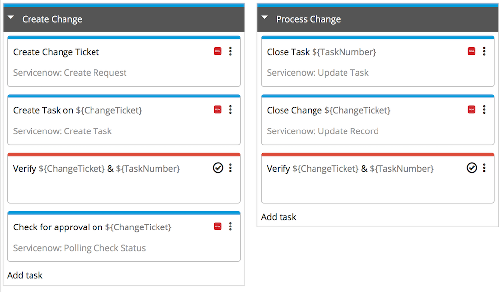

You can download an example template at the link as follows:
[ServiceNow_Example.xlr](images/ServiceNow_Example.xlr)

# Requirements #

This plugin (v3.x) requires XLR 4.8

# Interfaces #

The ServiceNow plugin integrates with the SNOW REST API v1 (i.e. `/api/now/v1/`)

## Types ##

### Change Requests ###

+ **Create Change Request** - This task will create a change request in ServiceNow.

	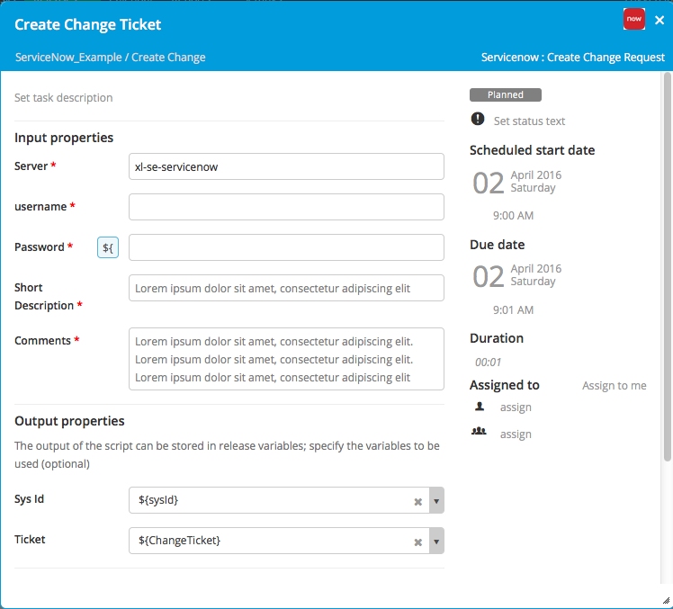
	
	This task will return the system ID of the change request as well as the change ticket ID.  These items can be used later in your release to interact with this ticket.		
	 
+ **Update Record** - This task can be used to make changes to change requests.

	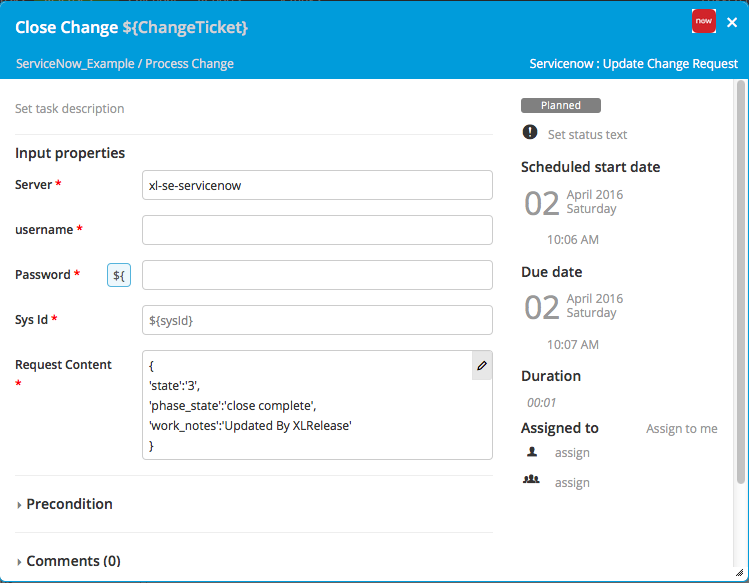
	
	By setting the Request Content you can change any fields in the ServiceNow change record
	
+ **Find Change Request By Ticket** - Find the change request sysId using the change request ticket number.

	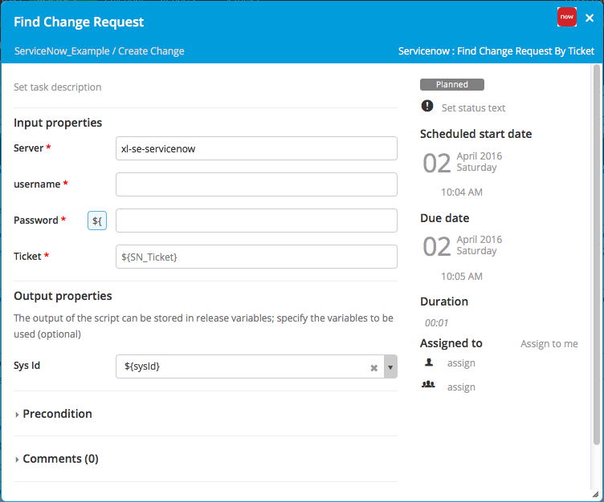
	

+ **Polling Check Status** - This task will poll for a specific change in one of the change request fields.  This task can be used to wait for the approval of a change request.

	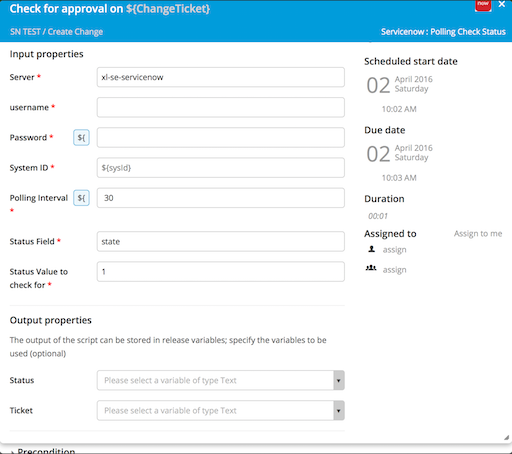
	
	The current status and ticket number are returned once the requred value has been set.

### Change Tasks###

+ **Create Change Task** - This task will create a change task associated with a change request in ServiceNow.

	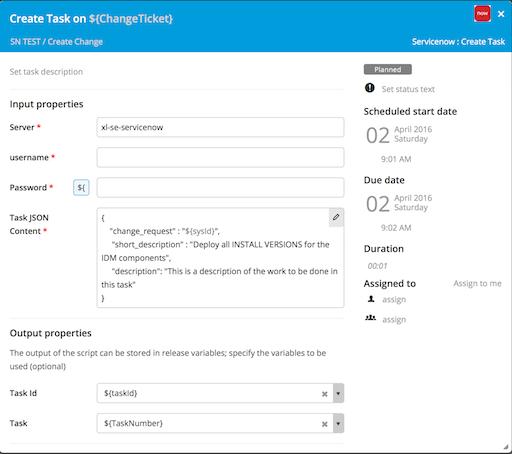
	
	This task will return the system ID of the change request as well as the change ticket ID.  These items can be used later in your release to interact with this ticket.  The Task JSON Content will be sent to Service Now to create the details of this change task

+ **Update Change Task** - This task can be used to make changes to change tasks.

	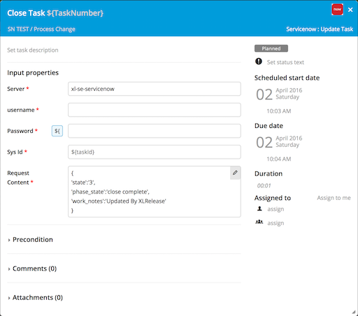
	
	By setting the Request Content you can change any fields in the ServiceNow change task
	
	
+ **Find Change Task By Task Id** - Find the change request task sysId using the change task number

	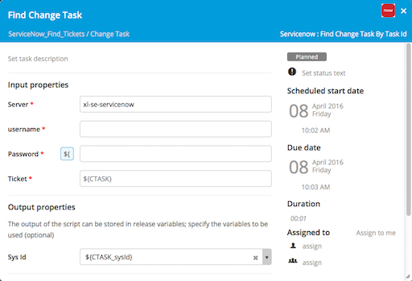
	

+ Request Approval
+ Update CMDB

### Incidents ###

+ **Create Incident** - This task will create a new incident.

	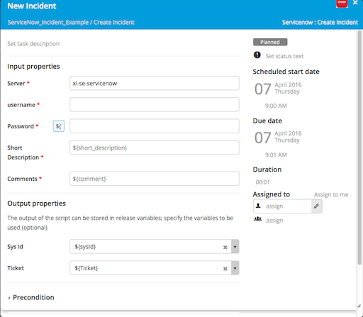

+ **Update Incident** - This task will update an existing incident

	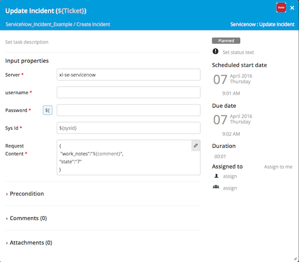

+ **Find Incident By Ticket** - This task will local the sysId of a incident record using the incident ticket number

	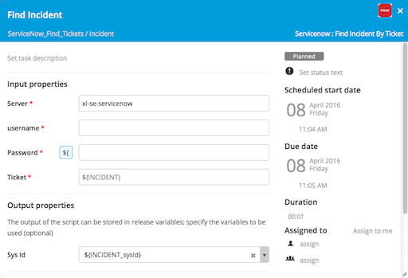

### Service Requests ###
	
+ **Create Service Request Item** - This task will create a service request.  

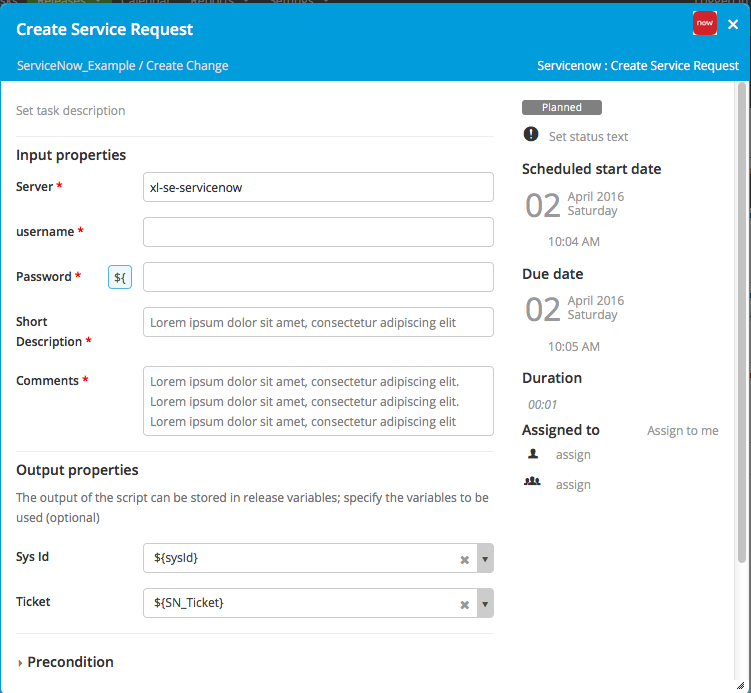

+ **Update Service Request Item** - Update an existing service request item

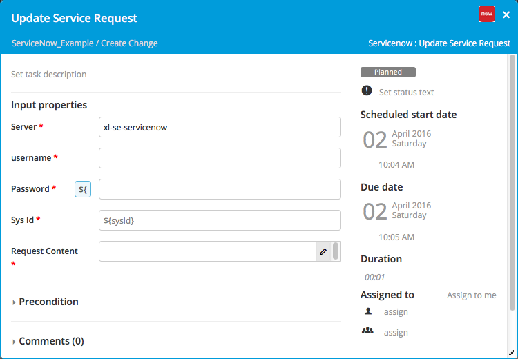

+ **Find Service Request Item By Ticket** - Use this taks to find the *sysId* of the request item by the human readable ticket number.

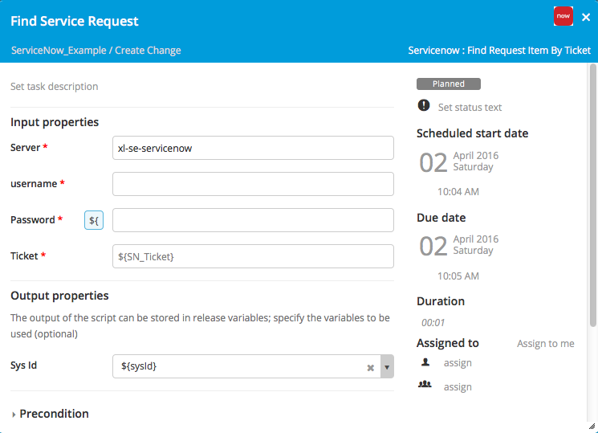

	
### Service Request Items ###
	
+ **Create Service Request Item** - This task will create a service request item.  It expects that there is already a service request opened that this item can be attached to.	

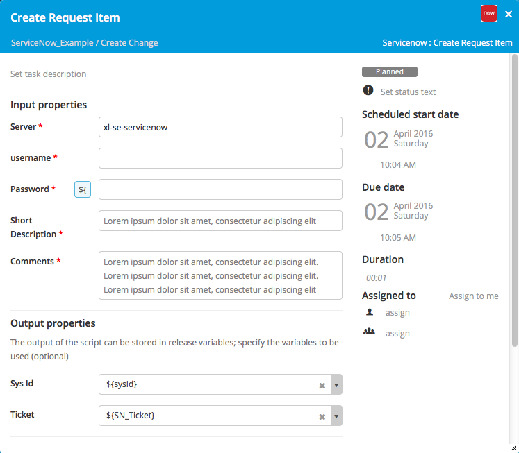

+ **Update Service Request Item** - Update an existing service request item

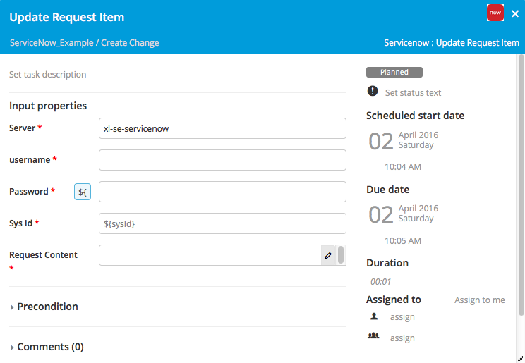

+ **Find Service Request Item By Ticket** - Use this taks to find the *sysId* of the request item by the human readable ticket number.

### General Tasks ###

* **Schedule Task** - Use data in a ServiceNow ticket to schedule a task to run at some time in the future.

	* Start Date Field: Field in ServiceNow record to use for the start date of the target task
	* Phase to start release window: The Release phase to look for the task that will start based on the ServiceNow start date
	* Task to start release window: This is the task that will have its start data and time set based on the ServiceNow ticket start time
	* Servicenow Date format: The date format to use to parse ServiceNow dates
	* XL Release Date format: That date format to use to part XL Release dates
	* ServiceNow key-value map: XL Release variable to keep information about an ServiceNow ticket.  This data should include the date and time that the release is scheduled to continue.

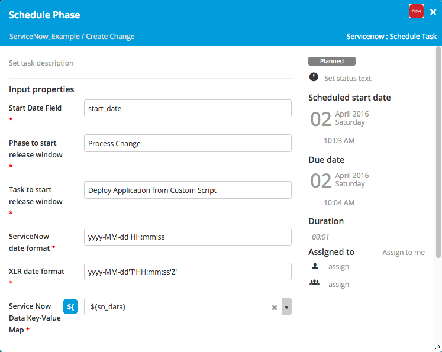

# References #
1. [Service Now REST API Wiki](http://wiki.servicenow.com/index.php?title=Table_API#gsc.tab=0)

